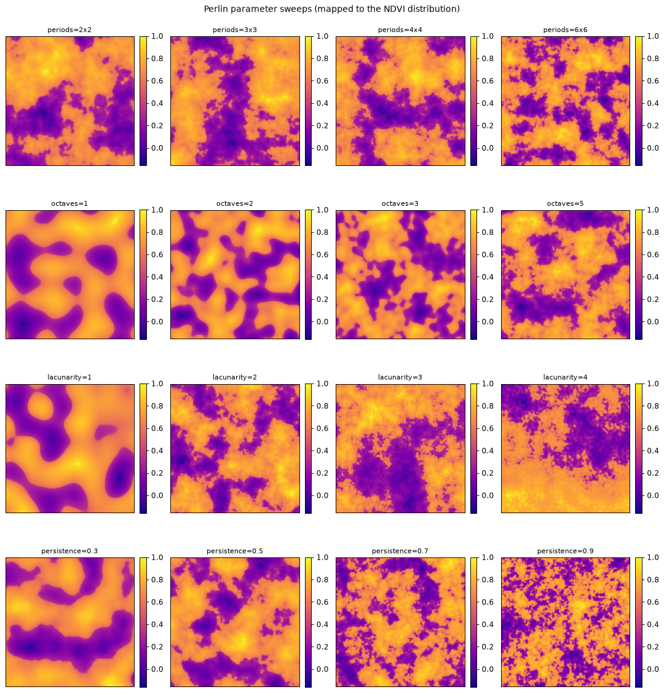
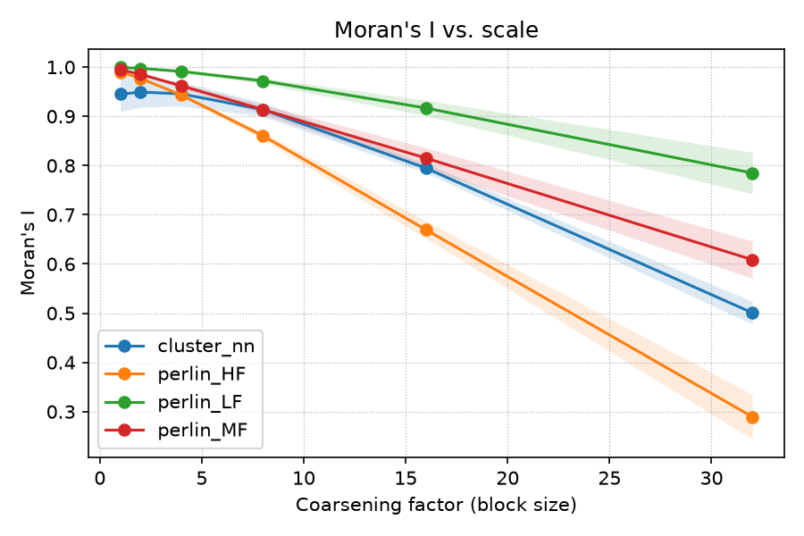
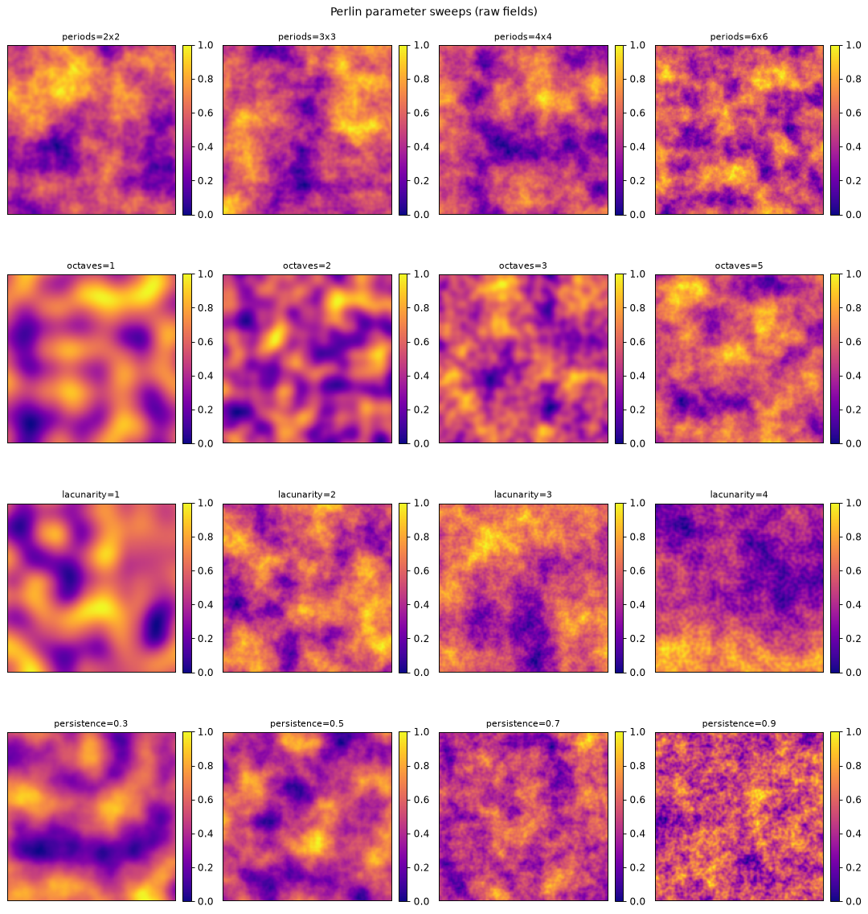

# nlm_synth

Synthetic landscapes that carry a **controlled amount of spatial structure** while
reproducing an **observed value distribution**, plus the tooling to measure how
their statistics change as pixel size grows.

The motivating question comes from remote sensing: when a satellite product is
resampled from 30 m to 500 m, how much landscape heterogeneity survives, and how
much of that answer depends on the *arrangement* of the values rather than the
values themselves? Answering it requires landscapes where the two can be varied
independently. That is what this package builds.

[](https://github.com/ShadmanAmin/nlmpy_synth/actions/workflows/ci.yml)
[](https://www.python.org/downloads/)
[](LICENSE)

---

## The idea

A raster is decomposed into two independent parts:

1. **Spatial structure** — supplied by a neutral landscape model (NLM). Perlin
   noise gives smoothly tunable spatial frequency; a random-cluster
   nearest-neighbour model gives patchy, percolation-like structure.
2. **The marginal distribution** — supplied by the user as a 1-D array of values,
   typically real NDVI pixels from a scene.

The NLM field is then **quantile-mapped by rank** onto the distribution: the cell
with the *k*-th smallest field value receives the *k*-th quantile of the samples.
The output therefore reproduces the target distribution essentially exactly while
keeping the NLM's spatial arrangement.

Because every generator shares one distribution, any difference in how statistics
respond to coarsening is attributable to spatial structure alone.



*Each panel has an identical NDVI distribution. Only the spatial arrangement differs.*

---

## Installation

```bash
git clone https://github.com/ShadmanAmin/nlmpy_synth.git
cd nlmpy_synth
python -m venv .venv && source .venv/bin/activate
pip install -e ".[geo,fit]"
```

| Extra | Pulls in | Needed for |
| --- | --- | --- |
| *(base)* | numpy, pandas, matplotlib, nlmpy | Field generation, coarsening, statistics, the NumPy Monte Carlo |
| `geo` | xarray, rioxarray, rasterio, affine | GeoTIFF I/O, the georeferenced experiment, parameter fitting |
| `fit` | scipy ≥ 1.15, scikit-learn | Mixture-distribution sampling (`nlm_synth.et_params`) |
| `dev` | pytest, pytest-cov, ruff | Running the test suite |

The core workflow runs without the geo stack; the geo modules are imported lazily
and raise a clear message pointing at the extra if they are missing.

> **Note on nlmpy.** nlmpy 1.2 requires `numba`. It also imports
> `scipy.ndimage.measurements`, which is deprecated — harmless, and filtered in the
> test configuration.

---

## Quickstart

```python
import numpy as np
import nlm_synth as ns

# 1. A target distribution: real NDVI pixels, or a synthetic stand-in.
rng = np.random.default_rng(123)
samples = np.clip(np.hstack([rng.normal(0.70, 0.08, 50_000),
                             rng.normal(0.20, 0.09, 30_000)]), -0.2, 1.0)

# 2. A field with that distribution and a chosen spatial structure.
field = ns.synth_ndvi_from_distribution(
    512, 512, samples,
    method="perlin",
    method_kwargs=dict(periods=(4, 4), octaves=5, lacunarity=2, persistence=0.6),
    seed=42,
)

# 3. The distribution is reproduced; the structure is not white noise.
print(np.percentile(field, [5, 50, 95]))    # matches np.percentile(samples, ...)
print(ns.morans_i(field))                   # ~0.99, strongly autocorrelated

# 4. How do the statistics behave as pixels grow?
df, meta = ns.run_experiments(samples, nrow=512, ncol=512, n_runs=10)
print(df.pivot_table(index="factor", columns="label", values="morans_I"))
```

For a guided walkthrough, open [`notebooks/quickstart.ipynb`](notebooks/quickstart.ipynb).

---

## The scale effect

`run_experiments` generates many realisations per structure, block-averages each to
a range of pixel sizes, and records statistics at every scale. Moran's I for four
reference generators, 10 realisations of 512×512, all sharing one NDVI distribution:

| block size | perlin_LF | perlin_MF | perlin_HF | cluster_nn |
| ---: | ---: | ---: | ---: | ---: |
| 1 | 0.999 | 0.995 | 0.990 | 0.945 |
| 4 | 0.991 | 0.962 | 0.943 | 0.946 |
| 16 | 0.917 | 0.815 | 0.669 | 0.794 |
| 32 | 0.785 | 0.609 | 0.290 | 0.501 |



All four start near 1.0 and all decay, but the *rate* differs sharply: at a 32-cell
block, coarse-grained structure retains a Moran's I of 0.79 while fine-grained
structure has fallen to 0.29 — a difference driven entirely by spatial arrangement,
since the value distributions are identical. Variance behaves the same way, while
the mean is invariant (block averaging preserves it).

Reproduce the table and both figures with:

```bash
python examples/run_monte_carlo.py --out-dir outputs
```

---

## Command line

Every workflow is also a subcommand, so results can be regenerated without writing
Python:

```bash
nlm-synth mc --out-dir outputs --runs 10           # Monte Carlo + plots
nlm-synth geotiff --out-dir outputs/rasters        # same, writing GeoTIFFs
nlm-synth fit scene.tif --out-csv best_params.csv  # fit parameters to a raster
```

Pass `--samples path` to drive any of them from your own data — a `.npy` array, a
single-column `.csv`/`.txt`, or any raster rioxarray can open. Without it, a
synthetic bimodal demo distribution is used.

---

## Choosing the structure

Perlin noise is controlled by four parameters:

| parameter | effect | typical range |
| --- | --- | --- |
| `periods` | patch size; more periods means finer patches | `(2,2)` – `(12,12)` |
| `octaves` | number of noise layers summed; more adds fine detail | 1 – 6 |
| `lacunarity` | frequency growth per octave (integer) | 2 – 4 |
| `persistence` | amplitude decay per octave; higher keeps more fine detail | 0.3 – 0.9 |



Regenerate these panels with `python examples/plot_parameter_sweeps.py`. Individual
per-parameter comparisons (raw field beside its NDVI-mapped version) are in
[`docs/figures/`](docs/figures).

The `cluster` method instead builds a binary random-cluster field, blended with
fine-scale Perlin noise so the quantile mapping yields a continuous surface rather
than two discrete levels. `p` sets the proportion of the field in the high class;
`cluster_p` sets nlmpy's own clustering parameter, where values near the percolation
threshold (~0.59 for a 4-neighbourhood) give the largest connected patches.

---

## Fitting parameters to a real scene

To make a synthetic landscape resemble an observed one, grid-search the parameters
whose structure best matches it:

```bash
nlm-synth fit scene.tif --out-csv best_params.csv --diagnostics-csv all_scores.csv
```

Matching uses two descriptors of the **rank-transformed** image — its radially
averaged power spectrum and its Moran's I — so the fit responds to structure only
and is unaffected by the scene's value distribution. The default 300-plus candidate
grid takes roughly 10 seconds on a 200×200 scene.

**Perlin parameters are not identifiable.** Different combinations of `periods`,
`octaves`, `lacunarity` and `persistence` produce near-identical spectra, so the fit
may return a parameter set other than the one that generated a field while matching
its structure just as closely. Judge fit quality by comparing the reported
`target_moran` against `candidate_moran`, rather than reading the parameters as
ground truth.

By default the search skips candidates whose internal grid would exceed the field's
own size. Such candidates show less than one period of the coarsest octave across
the image — a smooth gradient whose finest octave aliases at about one period per
cell — and they are also the expensive ones. Pass `--max-internal-dim N` to widen
the search at the cost of time and memory.

---

## Georeferenced output

`run_experiments_geotiff` runs the same experiment but writes a GeoTIFF per
realisation per scale, with the CRS preserved and the transform rescaled so each
coarsened raster keeps its origin and covers the same ground extent:

```python
from nlm_synth.xarray_mc import run_experiments_geotiff

df, meta = run_experiments_geotiff(
    samples, out_dir="outputs/rasters",
    nrow=512, ncol=512, pixel_size=30.0,
    x0=500_000.0, y0=4_000_000.0, crs="EPSG:32611",
    coarsen_factors=(1, 2, 4, 8, 16, 32), n_runs=5,
)
```

Rasters land in one subdirectory per generator as
`{prefix}_{label}_run{n}_f{factor}.tif`, alongside `results_mc_geotiff.csv`. Pass
`write_rasters=False` for statistics only — much faster when the rasters are not
needed. Both drivers produce identical statistics for the same seed, which the test
suite asserts.

---

## Distribution modelling

`nlm_synth.et_params` samples two-component Gaussian mixture parameters by Latin
hypercube, for surface-energy-balance variables that are typically bimodal
(vegetated versus bare, sunlit versus shaded):

```python
from nlm_synth.et_params import create_et_parameters

ndvi = create_et_parameters()["NDVI"]
ndvi.lhs_sample(n_samples=1, seed=0)

bimodal = ndvi.create_dist("mixture").sample(100_000)
unimodal = ndvi.create_dist("normal").sample(100_000)   # same mean and sd
```

Running the experiment with each in turn quantifies what is lost by approximating a
bimodal surface as unimodal — see `examples/run_geotiff_monte_carlo.py --dist normal`.

---

## Repository layout

```
src/nlm_synth/         the package
  generators.py        NLM fields and rank-based quantile mapping
  coarsen.py           block-mean coarsening
  stats.py             Moran's I, semivariogram, summary statistics
  monte_carlo.py       the NumPy multi-scale experiment
  xarray_mc.py         the georeferenced experiment
  geox.py              array to CRS-aware xarray / GeoTIFF
  approximations.py    fitting Perlin parameters to an observed raster
  et_params.py         mixture-distribution sampling
  visualize.py         plotting helpers
  cli.py               the nlm-synth command line
examples/              runnable scripts, each with --help
notebooks/             quickstart walkthrough
tests/                 pytest suite
docs/figures/          figures used in this README
```

## Development

```bash
pip install -e ".[geo,fit,dev]"
pytest            # ~140 tests, about a minute
ruff check .
```

Moran's I is verified against a deliberately naive double-loop reference
implementation in `tests/conftest.py`, so the vectorised version is checked against
something obviously correct rather than against itself.

## Reproducibility

Every entry point takes a `seed` or `random_seed`. Per-realisation seeds are drawn
as a `(generator, run)` block up front, so adding a generator to a grid does not
perturb the realisations of the others — results stay comparable when an experiment
is extended. Both `run_experiments` and `run_experiments_geotiff` return a `meta`
dict recording the settings needed to reproduce a run, and the CLI writes it to
`meta_*.json` alongside the results.

nlmpy draws from the legacy global NumPy RNG, so `perlin_field` must seed it. It
saves and restores the surrounding RNG state, so seeding a field never disturbs the
caller's random stream.

## Citation

If you use this package, please cite it via [`CITATION.cff`](CITATION.cff), and cite
the underlying methods:

- Etherington, T.R., Holland, E.P., O'Sullivan, D. (2015). NLMpy: a Python software
  package for the creation of neutral landscape models.
  *Methods in Ecology and Evolution* 6:164–168. https://doi.org/10.1111/2041-210X.12308
- Etherington, T.R. (2022). Perlin noise as a hierarchical neutral landscape model.
  *Web Ecology* 22:1–6. https://doi.org/10.5194/we-22-1-2022

## License

MIT — see [LICENSE](LICENSE).
